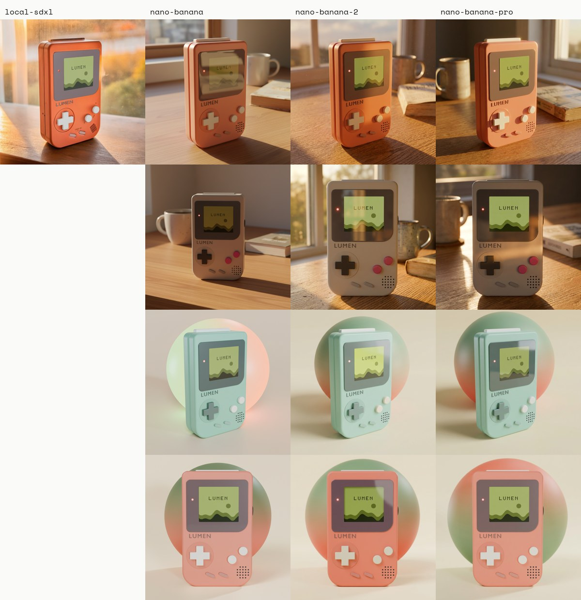

# From CAD to Shelf (working title)

An original retro handheld, **LUMEN**, taken from a 3D model built in code to a library of campaign assets.
A probabilistic decision layer (Jev) plans the creative and routes every asset: publish, human review, or regenerate.

> Research demo. LUMEN is an invented product: no real brand, logo or product is used.

## Status

- [x] The product, built in Blender from code: exact geometry, four colorways
- [x] Control passes from any product: depth, normals, product mask, protected-parts mask, beauty per colorway
- [ ] Creative planning with probabilities (Jev)
- [x] Photoreal generation in ComfyUI: local SDXL + ControlNet, and Gemini image models compared
- [ ] Quality routing by confidence (Jev), compared with a VLM judge and a human
- [ ] Copy from a fixed spec sheet
- [ ] Report: cost per approved asset, calibration, latency

## Any product in

The pipeline never knows what the product is. It takes a folder with:

- `product.glb`: the 3D model, from CAD, Blender, a scan or a generator
- `product.json`: name, facts for the copy, `colorways` (material name -> colour, roughness, transmission),
  `protected_materials` (parts that must never change), and optional `yaw_offset` and `passes` settings

```bash
blender -b -P pipeline/passes.py -- products/lumen runs/lumen/passes          # every colorway
blender -b -P pipeline/passes.py -- products/lumen runs/lumen/passes --quick  # first colorway only
```

It rescales the model to `size_mm` (models come in any unit), centres it on the floor, frames four cameras on its own
silhouette, and writes, per view:
`depth.png`, `normal.png`, `mask.png`, `mask_protected.png`, `beauty_<colorway>.png`, plus `manifest.json`.

Textured materials work too: a colorway tints the texture instead of replacing it.

`py tools/sheet.py runs/<product>/passes docs/img/<product>-passes.jpg` draws a contact sheet of a run.

`py tools/report.py` writes `runs/index.html`, a local report of everything produced so far: each product's input
(a 3D viewer of the GLB, its spec and colorways) and every pass, per view and colorway. Serve the repo root with
`py -m http.server 5190` and open http://localhost:5190/runs/.

## Two products, one pipeline

The same code, only the product folder changes. Rows are views; columns are the beauty per colorway, depth, normals,
mask and protected-parts mask.

**LUMEN**, built for this project:


**BoomBox**, a third-party model ([Khronos glTF Sample Assets](https://github.com/KhronosGroup/glTF-Sample-Assets/tree/main/Models/BoomBox), CC0),
one textured material at 2 cm in its file, rescaled and framed with no changes to the pipeline:


The control passes render with EEVEE, in seconds. The beauty renders use Cycles on the GPU (OptiX when there is one), with
Blender's bundled studio HDRI for reflections, a shadow-catcher floor for the contact shadow, soft area lights scaled to
the product, and a faint micro-surface bump on every material. `product.json` can tune it under `render`
(`samples`, `light`, `hdri`, `hdri_strength`, `micro_surface`), and a colorway can add `coat` to any material.
`--view <name>` renders one view, to iterate fast.

## The first test product: LUMEN

`fixtures/lumen/build.py` builds LUMEN at real size (90 x 148 x 30 mm) and renders a studio shot.

```bash
blender -b -P fixtures/lumen/build.py -- white              # one colorway, also saves out/lumen.blend and out/lumen.glb
blender -b -P fixtures/lumen/build.py -- all                # every colorway
blender -b -P fixtures/lumen/build.py -- white --front      #
blender -b -P fixtures/lumen/build.py -- --export products/lumen  # as a pipeline product orthographic front view
```

Colorways, in the meridian palette: `white`, and `signal-orange` in the brand's own orange (#FF5E2C). Every part has an object index
(1 body, 2 screen, 3 controls, 4 cartridge, 5 internals) for the product masks later on.


## A campaign in one command

```bash
py pipeline/run.py campaigns/lumen-launch.json
```

The campaign file lists the pieces: template, format, view, colorway and tagline. The runner does
passes -> generate -> consistency -> route -> layout -> report, reuses whatever is already there, regenerates with a
new seed when the routing says so, and writes `runs/index.html`.

## Consistency

Every view is generated on its own, so a model is free to invent a different d-pad each time. Three things stop it,
and the result is measured:

1. **Hold the geometry.** Depth and normals drive ControlNet hard, and the sampler starts from the studio render, so
   the shape is the product's, not the model's.
2. **Colour and tone per part.** The passes stage renders a parts map (one flat colour per material). After
   generation, each part takes the hue and chroma the spec gives it, and is nudged to the lightness it has in the
   render, so a light recess cannot come back dark. Inside each part, the photo keeps its own shading.
3. **Fine detail from the render.** Detail above a blur radius (speaker holes, printed type, seams) comes from the
   render; the light comes from the photo. The screen and the logo are replaced exactly.

`pipeline/consistency.py --check` then measures how far apart the views are, per part, as delta E. On the LUMEN
launch run: 2.0 for white, 1.6 for signal orange, against a limit of 6.

## Brand: meridian

`brands/meridian/` holds the brand as data: palette, fonts (Inter Tight and Space Mono, OFL), logo, copy, scenes
and templates. `pipeline/layout.py` sets real type on the product images in three templates: `poster` (portrait,
story, square), `spread` (landscape) and `specsheet`. Another brand is another folder.

## Model comparison

The same view, scene and colorway through four image backends, with time and cost per image
(`runs/<product>/generate/ledger.jsonl`):



| Backend | Cost / image | Time | Notes |
|---|---|---|---|
| local-sdxl (RealVisXL + ControlNet) | free | ~10 min on a 6 GB laptop GPU | the camera is exact, so the protected parts can be locked back; invents detail elsewhere |
| nano-banana | US$ 0.039 | ~17 s | faithful to the product, looks rendered |
| nano-banana-2 | US$ 0.084 | ~19 s | faithful and photographic: the best value |
| nano-banana-pro | US$ 0.161 | ~30 s | the most photographic, marginally |

All three Gemini models warm a grey product towards beige under sunset light: a colour check belongs in the routing stage.
The project continues on local SDXL, free, with the layout as the goal.
