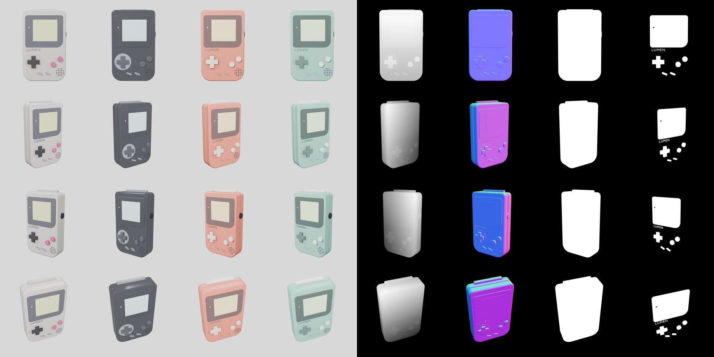
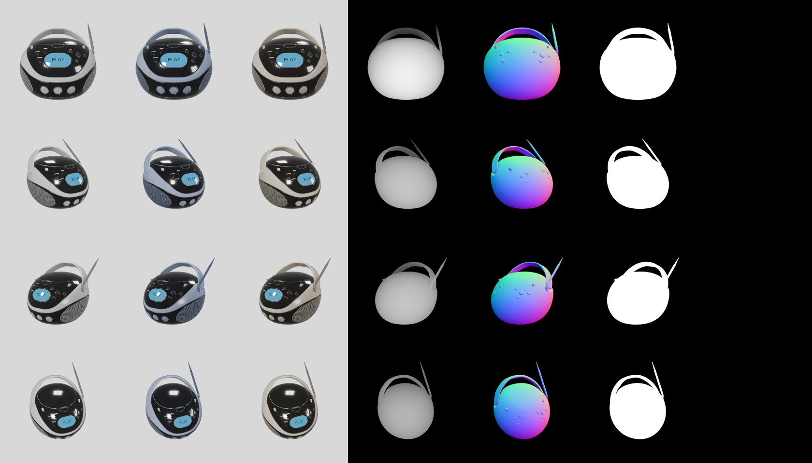
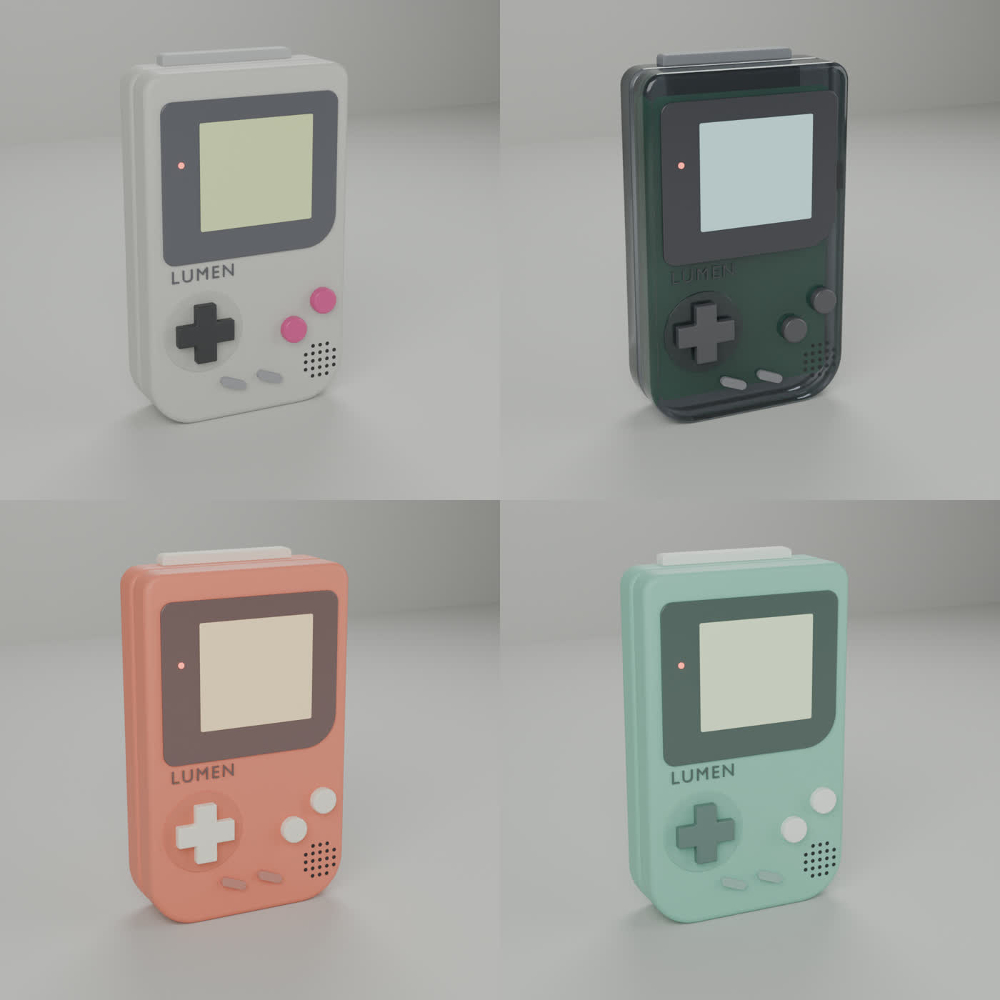

# From CAD to Shelf (working title)

An original retro handheld, **LUMEN**, taken from a 3D model built in code to a library of campaign assets.
A probabilistic decision layer (Jev) plans the creative and routes every asset: publish, human review, or regenerate.

> Research demo. LUMEN is an invented product: no real brand, logo or product is used.

## Status

- [x] The product, built in Blender from code: exact geometry, four colorways
- [x] Control passes from any product: depth, normals, product mask, protected-parts mask, beauty per colorway
- [ ] Creative planning with probabilities (Jev)
- [ ] Photoreal generation in ComfyUI with ControlNet
- [ ] Quality routing by confidence (Jev), compared with a VLM judge and a human
- [ ] Copy from a fixed spec sheet
- [ ] Report: cost per approved asset, calibration, latency

## Any product in

The pipeline never knows what the product is. It takes a folder with:

- `product.glb`: the 3D model, from CAD, Blender, a scan or a generator
- `product.json`: name, facts for the copy, `colorways` (material name -> colour, roughness, transmission),
  `protected_materials` (parts that must never change), and optional `yaw_offset` and `passes` settings

```bash
blender -b -P pipeline/passes.py -- products/lumen runs/lumen/passes          # every colorway
blender -b -P pipeline/passes.py -- products/lumen runs/lumen/passes --quick  # first colorway only
```

It rescales the model to `size_mm` (models come in any unit), centres it on the floor, frames four cameras on its own
silhouette, and writes, per view:
`depth.png`, `normal.png`, `mask.png`, `mask_protected.png`, `beauty_<colorway>.png`, plus `manifest.json`.

Textured materials work too: a colorway tints the texture instead of replacing it.

`py tools/sheet.py runs/<product>/passes docs/img/<product>-passes.jpg` draws a contact sheet of a run.

## Two products, one pipeline

The same code, only the product folder changes. Rows are views; columns are the beauty per colorway, depth, normals,
mask and protected-parts mask.

**LUMEN**, built for this project:



**BoomBox**, a third-party model ([Khronos glTF Sample Assets](https://github.com/KhronosGroup/glTF-Sample-Assets/tree/main/Models/BoomBox), CC0),
one textured material at 2 cm in its file, rescaled and framed with no changes to the pipeline:



Known limit: the beauty renders use EEVEE for speed, so the Clear Smoke shell reads as opaque. The control passes are not affected.

## The first test product: LUMEN

`fixtures/lumen/build.py` builds LUMEN at real size (90 x 148 x 30 mm) and renders a studio shot.

```bash
blender -b -P fixtures/lumen/build.py -- arcade-grey        # one colorway, also saves out/lumen.blend and out/lumen.glb
blender -b -P fixtures/lumen/build.py -- all                # every colorway
blender -b -P fixtures/lumen/build.py -- arcade-grey --front #
blender -b -P fixtures/lumen/build.py -- --export products/lumen  # as a pipeline product orthographic front view
```

Colorways: `arcade-grey`, `clear-smoke`, `sunset-coral`, `mint`. Every part has an object index
(1 body, 2 screen, 3 controls, 4 cartridge, 5 internals) for the product masks later on.


