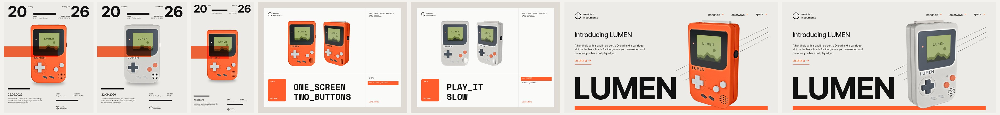
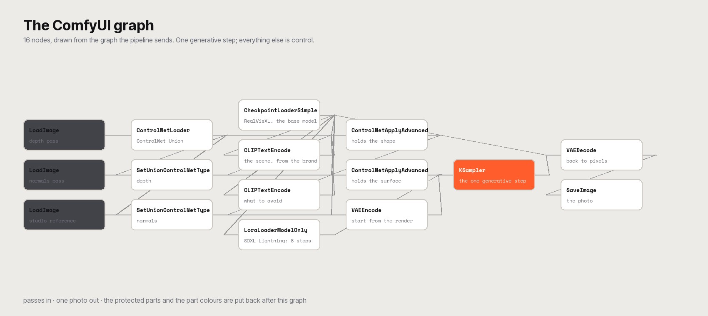
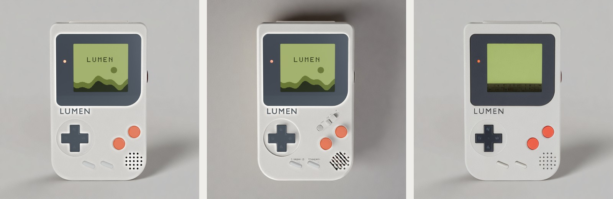
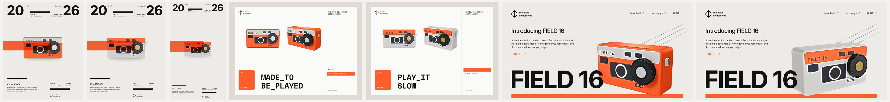

# From CAD to Shelf

A product in, a campaign out. Give the pipeline a 3D model with its spec and a brand file, and it renders the control
passes, generates photoreal product photography, holds the product consistent across every view, checks each photo,
writes the copy from the product's own facts and sets the brand type on the finished pieces.

> Everything here is a research demo. Both products, LUMEN and FIELD 16, and the meridian brand are invented for this
> repository. No real brand, logo or product is used.



## Two inputs

| Input | What it is | What it decides |
|---|---|---|
| `products/<name>/` | `product.glb` + `product.json` | shape, materials, colorways, protected parts, the facts the copy is built from |
| `brands/<name>/` | palette, fonts, logo, voice, scenes, templates | how every piece looks and sounds |

```bash
py pipeline/run.py campaigns/lumen-launch.json
```

One command does the whole campaign: passes -> generate -> consistency -> route -> copy -> layout -> report. It reuses
whatever is already there, regenerates a photo with a new seed when the routing asks for it, and writes
`runs/index.html`, a report that tells each campaign end to end.

## The stages

| Stage | File | What it does |
|---|---|---|
| Passes | `pipeline/passes.py` | Imports any GLB, rescales it to its real size, frames four cameras on its own silhouette, and renders depth, normals, the product mask, the protected-parts mask, a parts map (one flat colour per material) and a studio reference per colorway |
| Generate | `pipeline/generate.py` | Builds and sends a ComfyUI graph: RealVisXL with ControlNet on your GPU, or a Gemini image model through the Comfy API. Paid backends need `--spend` and a key, and every call is written to a ledger |
| Consistency | `pipeline/consistency.py` | Gives every part its spec colour and tone in every view, takes the fine detail from the render, and measures how far apart the views are |
| Route | `pipeline/qa.py` | Colour against the spec (hue and chroma), protected parts against the reference: publish, review or regenerate |
| Copy | `pipeline/copy.py` | Taglines and an introduction built from the product's facts. It rearranges and shortens, it never adds a claim |
| Layout | `pipeline/layout.py` | Poster, spread and spec sheet, with the brand's real type, colours and logo. Type is never generated by a model |
| Report | `tools/report.py` | `runs/index.html`: inputs, photos with their verdicts, and the pieces, campaign by campaign |



## What each guard is worth

The same view, the same seed, with parts of the pipeline turned off (`py tools/ablation.py products/lumen runs/lumen/passes front white`):

| Variant | Colour ΔE | Protected parts ΔE | Worst part vs spec | Verdict | What the image shows |
|---|---|---|---|---|---|
| the pipeline as it ships | 0.5 | 0.1 | 7.0 | publish | the product, as designed |
| ControlNet at half strength | 2.1 | 0.1 | 7.0 | publish | invented buttons, a different grille, text that is not there |
| no colour, tone or detail put back | 0.5 | 8.6 | 5.6 | review | the screen art is gone and letters appear on the d-pad |



## Consistency

Every view is generated on its own, so a model is free to invent a different dial each time. Three things stop it, and
the result is measured:

1. **Hold the geometry.** Depth and normals drive ControlNet hard and the sampler starts from the studio render.
2. **Colour and tone per part.** Each part takes the hue and chroma the spec gives it and is nudged to the lightness
   it has in the render, so a light recess cannot come back dark. Inside a part, the photo keeps its own shading.
3. **Fine detail from the render.** Detail above a blur radius (printed type, grilles, seams) comes from the render;
   the light comes from the photo. The screen and the logo are replaced exactly.

`py pipeline/consistency.py --check` measures the drift between views, per part, as delta E.

## Two products, one pipeline

| | LUMEN, a handheld console | FIELD 16, a pocket camera |
|---|---|---|
| Views x colorways | 4 x 2 | 4 x 2 |
| Photos kept | 16 (11 publish, 3 review, 2 regenerated) | 5 (3 publish, 2 review) |
| Drift between views | 2.0 white · 1.6 signal orange | 5.5 white · 1.2 signal orange |
| Generation | ~3.4 min per photo, local, free | ~3.7 min per photo, local, free |
| Pieces | 7 | 7 |

Both are built from code in `fixtures/`, so the geometry is exact and the parts map is reliable:

```bash
blender -b -P fixtures/field16/build.py -- --export products/field16
blender -b -P pipeline/passes.py -- products/field16 runs/field16/passes
py pipeline/run.py campaigns/field16-launch.json
```



## What it costs

Local SDXL is free and runs on a 6 GB laptop GPU. The Gemini backends were measured on the same views and scenes:


| Backend | Cost per image | Time | Notes |
|---|---|---|---|
| local-sdxl | free | ~3.5 min | the camera is exact, so parts and colours can be locked back |
| nano-banana | US$ 0.039 | ~17 s | faithful, looks rendered |
| nano-banana-2 | US$ 0.084 | ~19 s | faithful and photographic |
| nano-banana-pro | US$ 0.161 | ~30 s | the most photographic, marginally |

## Rights

Code: MIT. The products, the brand and the generated images: CC0. Fonts: Inter Tight and Space Mono, SIL Open Font
License, in `brands/meridian/fonts/`.
